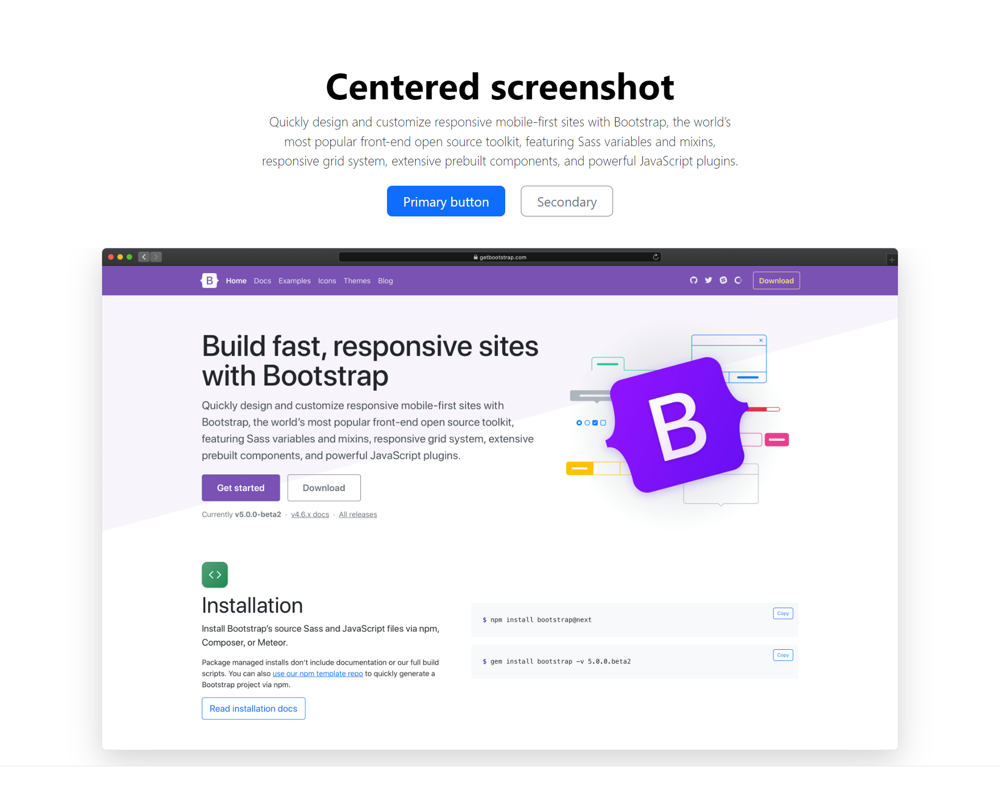

# Bootstap Starter File (vite & scss)

This file create your own Bootstap elements using scss.

## Outputs




## Steps

- Create a Laravel file

- install npm
```bash
  npm install
```

- install scss

```bash
  npm add -D sass
```

- install bootstrap

```bash
  npm i --save bootstrap @popperjs/core
```
- At resources\css

Create scss folder in resources dir and create a file app.scss 

- Then write this line at the file app.scss
@import "bootstrap/scss/bootstrap";

-Then write this line at vite.config.js

input: ['resources/css/app.css', 'resources/scss/app.scss','resources/js/app.js'],

- Blade

    @vite(['resources/css/app.css', 'resources/scss/app.scss','resources/js/app.js'])

## Deployment

To deploy this project run

```bash
  php artisan serve
```
```bash
  npm run dev
```
## 🔗 Links

[](https://www.linkedin.com/in/kazi-maruful-islam/)

